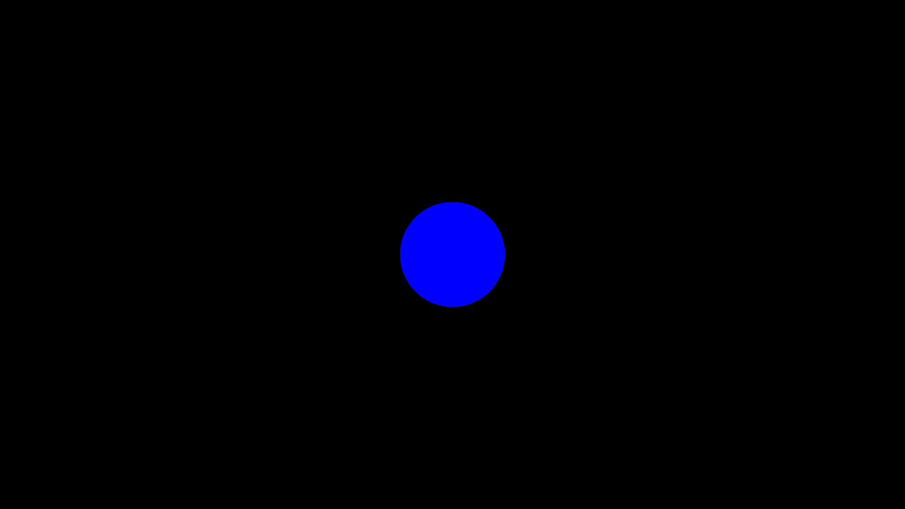

# Outdated, please see link below
https://github.com/OlDiggums/Portfolio_NormalsRaymarching

# Portfolio_PrimitiveRaymarching
Goal of this project is to implement a very basic implementation of Raymarching. The current implementation does not implement UV's or lighting. At this point it is simply a boolean image of wheter the ray has intersected a sphere or not.

## Math Involved
### Signed distance function of sphere --- <a href="https://michaelwalczyk.com/blog-ray-marching.html" title="Raymarching - Michael Walczyk">source</a>       
For this to work, we need to use the signed distance function of a sphere  
  `d: distance from sphere`  
  `p: point in space`  
  `c: center of sphere`  
  `r: radius of sphere`  
  `distance: distance from sphere`  
 
![F1]  

<!-- 
 -->

### Ray direction --- <a href="https://www.scratchapixel.com/lessons/3d-basic-rendering/ray-tracing-generating-camera-rays#:~:text=Using%20ray%2Dtracing%20to%20compute,is%20also%20called%20ray%2Dcasting.&text=Producing%20an%20image%20using%20ray,any%20surface%20in%20the%20scene." title="Ray-Tracing: Generating Camera Rays">source</a>
  `position: initial camera position`  
  `w: width of the image in pixels`  
  `h: width of the image in pixels`  
  `FOV: Field of view in degrees`  
  `a: aspect ratio of the image (w/h assuming w>h)`  
  `x: x position of pixel`  
  `y: y position of pixel`  
  `Px: x position of pixel in camera space`  
  `Py: y position of pixel in camera space`  
  `d: difference between point in space and initial position`  
  `dir: direction of the ray`  
 
![F2]   
 
![F3]   
 
![F4]    
  
 ![F5]   
  

[F1]: https://latex.codecogs.com/png.image?\dpi{110}distance=\left\|p-c&space;\right\|-r
[F2]: https://latex.codecogs.com/png.image?\dpi{110}Px=2*((\frac{x&plus;0.5}{width})-1)*tan(\frac{FOV}{2}*\frac{\pi}{180})*a
[F3]: https://latex.codecogs.com/png.image?\dpi{110}Py&space;=&space;(1-2*\frac{y&plus;0.5}{height})*tan(\frac{FOV}{2}*\frac{\pi}{180})
[F4]: https://latex.codecogs.com/png.image?\dpi{110}d&space;=&space;(Px,Py,-1)-position
[F5]: https://latex.codecogs.com/png.image?\dpi{110}dir&space;=&space;\frac{d}{\left|&space;d\right|}

### Result

